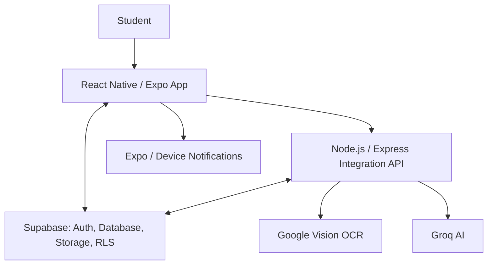
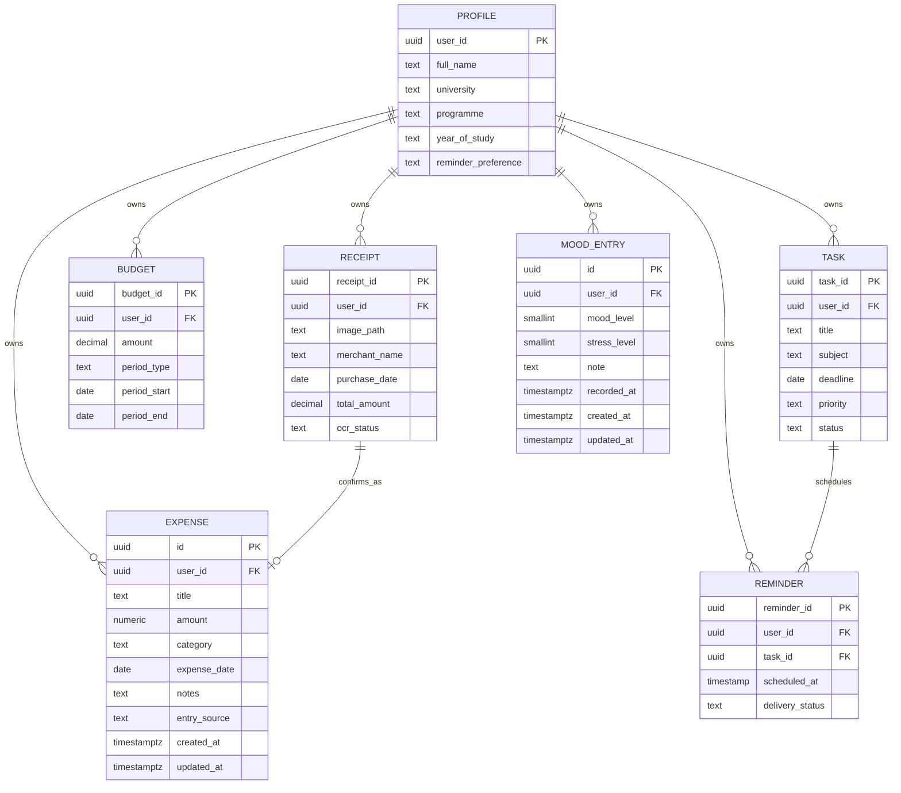
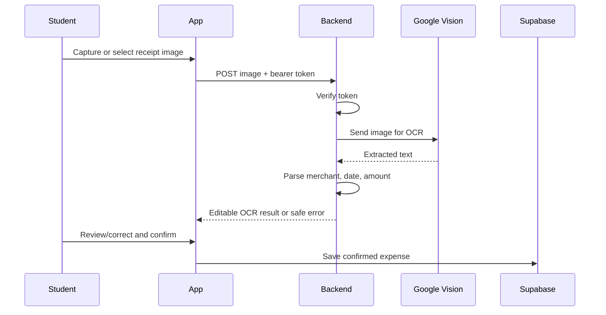
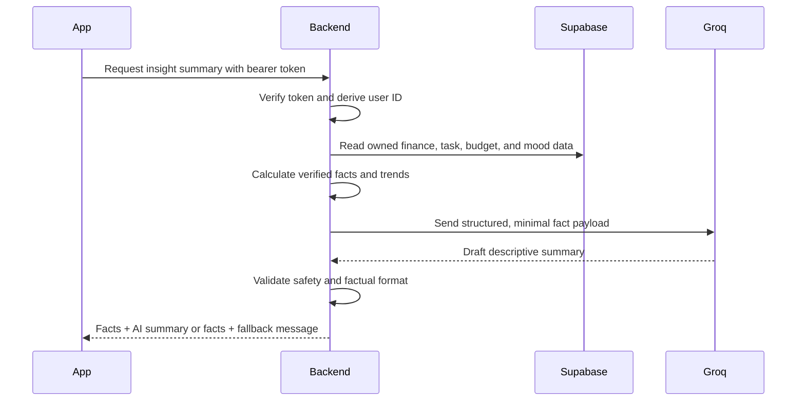

# Unifyd Software Design Document (SDD)

## 1. Purpose and design scope

This Software Design Document defines how the Unifyd PSM 2 requirements will be implemented. It is an implementation blueprint, not permission to add unapproved features. It supports the requirements in `UNIFYD_SRS.md` and must be read before coding a new phase.

## 2. Architectural goals

- Keep the mobile application fast and simple for student users.
- Protect each student’s data through Supabase Authentication and Row Level Security (RLS).
- Keep external API keys and provider-specific logic outside the mobile application.
- Use deterministic calculations for all important displayed facts.
- Use AI only for OCR extraction and optional descriptive summaries, with a safe fallback when unavailable.
- Preserve the existing Expo Router structure, including `/(tabs)`.

## 3. High-level architecture



### 3.1 Responsibility boundaries

| Component | Responsibilities | Must not do |
|---|---|---|
| React Native / Expo app | User interface, navigation, input validation, session-aware data display, local notification interaction | Store secret API keys or make trusted AI/OCR decisions alone |
| Supabase | Authentication, relational data storage, receipt-image storage if required, RLS enforcement | Expose one user’s records to another user |
| Node.js / Express | Verify caller token, call external providers, parse OCR result, calculate and validate insight payloads, apply fallback rules | Return provider secrets or accept unverified user IDs |
| Google Vision | Extract readable receipt text | Save a financial record without student review |
| Groq AI | Convert verified data into short descriptive insight text | Predict, diagnose, calculate authoritative totals, or override facts |
| Notification service | Schedule and deliver task reminders | Change task status when a notification is dismissed |

## 4. Mobile application design

### 4.1 Navigation model

The mobile application retains Expo Router navigation and uses the following functional areas:

| Area | Design responsibility |
|---|---|
| `app/_layout.tsx` | Initial application shell and authentication/session routing |
| Authentication screens | Welcome, sign-up, login, password-recovery/approved login support, and required profile completion |
| `app/(tabs)` | Protected primary navigation for Home/Dashboard, Wallet, Planner, Mind, and Profile |
| Wallet screens | Expense history, add/edit expense, budget view, receipt scanning and review |
| Planner screens | Task list, task detail, add/edit task, reminder history/settings access |
| Mind screens | Mood entry, mood history, wellness suggestion |
| Home/Dashboard screens | Cross-module summary panels and detailed-module navigation |
| Profile screens | Personal data, reminder preference, appearance settings, permissions guidance, and logout |

Existing screens and folders must be preserved. New routes or components may be added only where required by the approved phase; unrelated routes must not be moved, renamed, duplicated, or removed.

### 4.2 Frontend responsibilities

- Maintain an authenticated session and redirect unauthenticated users to authentication screens.
- Check whether required profile data exists before showing protected main functionality.
- Perform user-friendly client-side validation before database/API calls.
- Use a dedicated service layer for Supabase, backend API, notifications, and local utilities.
- Represent loading, empty, successful, and failure states explicitly.
- Refresh server data after mutations rather than relying on stale local calculations.

### 4.3 Component design rules

| Component type | Examples | Rule |
|---|---|---|
| Presentation components | Expense card, task card, budget card, mood selector, summary card | Receive data and callbacks through props; do not contain provider secrets or direct external AI calls |
| Form components | Expense form, task form, profile form, mood form | Validate required fields and display field-specific feedback |
| Screen components | Wallet screen, planner screen, dashboard | Coordinate data loading, mutation actions, navigation, and UI states |
| Service modules | Supabase client, API client, notification service | Centralise provider communication and return typed/normalised results |
| Utility modules | Currency/date formatting, calculation helpers, validation | Remain deterministic and easy to test |

### 4.4 Appearance preference

The app keeps the approved Dark palette unchanged. A semantic theme layer provides `screenBackground`, `screenText`, `mutedText`, `cardBackground`, `cardText`, `border`, `navigationBackground`, and brand tokens. Light changes the page to cool off-white and adjusts text and icons directly on that page; cards and bottom navigation retain their dark styling.

Profile Settings offers `system`, `light`, and `dark` in a collapsed-by-default Appearance row that shows the current selection. Expanding reveals the existing descriptions and radio choices. The choice is stored in `public.profiles.theme_preference` using the authenticated student's existing owner-scoped update path. The profile is refreshed after saving and the theme changes immediately; successful saves collapse the row, while failures keep it open. `system` follows the device appearance; the saved database default is `dark`. Semantic action tokens keep the white Edit Profile control legible, give the Home avatar a mode-appropriate circular outline, and style Sign out as a filled red action with white foreground.

### 4.5 Language preference

Onboarding offers the initial `en` (English) or `ms` (Bahasa Melayu) choice. Settings is the central editing location: its collapsed-by-default Language row shows the current value and expands to two radio choices. `LanguageProvider.saveLanguage()` writes `language_preference` to the authenticated user's existing `public.profiles` row; `AuthProvider.refreshProfile()` reloads it after a successful save, so Settings and the rest of the interface translate without restarting. A successful save collapses the section; a failure leaves it open with a translated error. Edit Profile contains identity, academic details, avatar, and reminder timing only. Missing or invalid language values fall back to English. `mobile/constants/i18n.ts` is the typed central source of translated interface strings and interpolation; `LanguageProvider` supplies the current language and translator to screens and shared controls. User-entered data, email addresses, and official UMPSA institution, faculty, and programme names are not translated. The existing applied profile preferences migration already provides this column; no additional migration is needed.

### 4.6 Legal information pages

Settings has a separate Legal card with direct links to protected `/privacy-policy` and `/terms-of-use` routes. Both routes reuse `mobile/components/profile/LegalPage.tsx` for the account heading, back action, October 2026 update line, and scrollable sections. All headings and copy use typed keys in `mobile/constants/i18n.ts` for English and Bahasa Melayu. The pages describe the academic prototype and planned optional features accurately, avoid guarantees or certifications, and do not collect consent or write to the database. They use the existing semantic Light and Dark tokens; no theme behavior or database migration changes are required.

## 5. Backend integration design

### 5.1 Backend responsibilities

The Node.js/Express backend is required only for actions that need protected provider credentials or trusted processing:

- OCR receipt processing through Google Vision;
- integrated-insight preparation and Groq summary generation;
- server-side token verification and access control for those endpoints;
- response validation, error handling, and safe fallbacks.

Standard user-owned CRUD data may use Supabase directly from the mobile app, protected by RLS.

### 5.2 API endpoints

| Endpoint | Method | Caller | Purpose | Success response |
|---|---|---|---|---|
| `/health` | GET | App/developer | Confirm backend availability | Non-sensitive service status |
| `/api/ocr/receipt` | POST | Authenticated app | Process a selected receipt image | Editable merchant, date, amount, raw extracted text/status |
| `/api/insights/generate` | POST | Authenticated app | Body `{ language: 'en' or 'ms', timeZone }`; generate a validated descriptive summary from verified facts | `facts`, `summary` (or `null`), `source` (`ai`/`fallback`), `fallbackReason`, `generatedAt` |

### 5.3 Backend request rules

- The app sends the current Supabase access token in the `Authorization: Bearer <token>` header.
- The backend verifies the token before processing an OCR or insight request.
- The backend derives the authenticated user ID from the verified token; it must not trust a user ID supplied in the request body.
- The backend returns only data that belongs to the authenticated user.
- Provider API keys are stored only in backend environment variables.
- Backend errors must be converted into short, safe, user-facing error codes/messages; raw provider errors and secrets must not be exposed.

The first receipt OCR backend phase lives in `server/`. `POST /api/ocr/receipt` verifies the supplied access token with Supabase Auth `getUser(token)` using the project URL and publishable key before parsing an upload. It accepts exactly one in-memory `image` part (JPEG, PNG, or WEBP, at most 5 MiB), checks both declared MIME type and file signature, and sends the bytes to Google Vision `documentTextDetection`. The official client uses local Google Application Default Credentials; no service-account JSON key is stored in the repository. The response is a review draft with nullable merchant, ISO purchase date, nullable positive total, raw detected text, and non-sensitive warnings. No file, OCR result, or expense is saved. Provider and authorization failures return safe error codes without receipt contents or credentials.

Receipt Phase 2 adds a protected Expo Router `/scan-receipt` route from Wallet. Expo ImagePicker offers camera and photo library selection. The app shows the selected image, rejects known unsupported types and images larger than 5 MiB, obtains the current Supabase session token, and sends one `image` FormData part to `${EXPO_PUBLIC_OCR_API_URL}/api/ocr/receipt`. It shows the returned fields, warnings, and detected text as a read-only, unsaved draft, with a link to the existing manual expense flow. A 45-second request timeout and safe translated errors cover unavailable, unauthorized, oversized, and invalid uploads. Web uses the picker-provided `File`; native uses the selected local file URI. The backend allows scoped browser preflight origins and has an optional private-network listener for physical-device development; bearer verification and upload validation are unchanged. Editable review, storage, and saving an OCR expense remain future work.

## 6. Data design

### 6.1 Entity relationship overview



### 6.2 Core tables and constraints

| Table | Key fields | Constraints and rules |
|---|---|---|
| `profiles` | `user_id`, name, university, programme, year, reminder preference | `user_id` links one-to-one with Supabase Auth user; essential profile data is required before protected use |
| `expenses` | `id`, `user_id`, `title`, `amount`, `category`, `expense_date`, `notes`, `entry_source`, `created_at`, `updated_at` | `id` is generated; `user_id` references `auth.users` with cascade delete; amount is positive `numeric(12,2)`; category and source use checks; date and timestamps have defaults |
| `receipts` | `receipt_id`, `user_id`, image reference, extracted fields, OCR status | OCR output is draft/review data until confirmed as an expense |
| `budgets` | `id`, `user_id`, `amount`, `period_type`, `period_start`, `created_at`, `updated_at` | Auth-owned with cascade delete; positive `numeric(12,2)` amount; weekly starts Monday and monthly starts on day 1; unique (`user_id`, `period_type`, `period_start`) |
| `tasks` | `id`, `user_id`, `title`, `subject`, `description`, `deadline`, `priority`, `status`, `completed_at`, `reminder_offset_minutes`, `created_at`, `updated_at` | Auth-owned with cascade delete; title/subject/deadline required; priority and status constrained; completion time matches completed status; nullable reminder offset permits 0, 60, or 1440 minutes |
| `catalog_courses` | `id`, `academic_session`, `semester`, `faculty_code`, `campus`, `course_code`, `course_name`, `credit_hours`, `source_label`, `is_active`, timestamps | Curated reference only; nonblank identifying fields; semester 1 or 2; optional positive credit hours; unique session/semester/campus/course code, including null campus; authenticated students read only active rows |
| `student_semester_courses` | `id`, `user_id`, `academic_session`, `semester`, `catalog_course_id`, `course_code`, `course_name`, `credit_hours`, `is_custom`, timestamps | Auth-owned with cascade delete; required session/name, semester 1 or 2, optional positive credit hours; non-custom rows link to a catalogue course and custom rows do not |
| `reminders` | `reminder_id`, `user_id`, `task_id`, scheduled time, status | Deleted/cancelled when the task is deleted or completed |
| `mood_entries` | `id`, `user_id`, `mood_level`, `stress_level`, `note`, `recorded_at`, `created_at`, `updated_at` | Auth-owned with cascade delete; both self-reported scales constrained to 1–5; optional note cannot be blank; multiple check-ins per day are permitted |

The applied Module 6 Phase 1 migration grants authenticated students column-scoped SELECT, INSERT, and UPDATE plus table-level DELETE, with owner-only RLS on all four operations. The app inserts only `user_id`, `mood_level`, `stress_level`, and nullable `note`; the database supplies IDs and timestamps. Students cannot update ownership, IDs, or timestamps. An index on `(user_id, recorded_at DESC)` supports private recent history. A private security-invoker trigger maintains `updated_at`. The values are self-reported wellbeing check-ins, not clinical measurements or diagnoses. AI insights and predictive features remain future phases.

The Phase 2 expense migration grants authenticated students only SELECT, DELETE, and column-scoped INSERT/UPDATE for manual expense fields. It never grants UPDATE on `user_id`, `entry_source`, IDs, or timestamps. Separate owner-only RLS policies cover SELECT, INSERT, UPDATE, and DELETE using `auth.uid() = user_id`; an index on `(user_id, expense_date DESC)` supports history and cascade deletion. A private, security-invoker trigger sets `updated_at` server-side. `entry_source` defaults to `manual`. The separate Phase 3 migration adds only authenticated INSERT permission for `entry_source`, allowing a reviewed OCR expense to be labelled `ocr` while retaining the same owner-only RLS and prohibiting source updates. That grant is prepared locally and has not been applied. Receipt images, extraction fields, and merchants are not stored in `expenses`.

The Phase 2 manual entry client uses the existing authenticated Supabase session and owner-only RLS. The protected `/add-expense` route validates title, positive decimal amount (maximum two fractional digits), category, and a local calendar date before inserting `user_id`, trimmed `title`, numeric `amount`, category code, ISO `expense_date`, and nullable `notes`. The client omits `entry_source`, leaving the database default `manual`. A failed insert retains the form and displays a safe translated error.

Wallet queries `public.expenses` with the current session's `user_id` and only the fields needed for history. It orders by `expense_date DESC`, then `created_at DESC`, with `id` as a stable tie-breaker, and pages through the result so the summary covers every saved expense rather than only the first server page. Existing owner-only RLS remains the database security boundary. A virtualized list displays translated category labels, title, localized date, RM amount, and an optional single-line note. The summary totals saved amounts in integer cents to avoid accumulation drift from decimal currency. Focus after a successful insert and pull-to-refresh reload the rows and total. Loading, empty, and safe retry states are explicit.

In Phase 4, a history row opens a protected Expense Detail route carrying only its record ID. Detail and Edit each fetch that single ID under the current session's `user_id`; RLS also restricts visibility. An inaccessible or missing row resolves to a safe not-found state. Add and Edit share the same field components and local validation. Edit updates only `title`, `amount`, `category`, `expense_date`, and `notes`, with an ID and current-user filter; the database retains ownership, source, and server-managed timestamps. Delete requires a translated confirmation showing the title and RM amount, then deletes only the selected ID under the current user. Update and delete require a returned row before reporting success. Both mutations return to Wallet, whose focus query refreshes the total and history. Budgets, OCR, receipts, charts, and AI remain outside this sub-phase.

The Module 4 budget data-foundation migration creates `public.budgets` without changing the expense table. The budget row stores one positive amount and a canonical start date per weekly or monthly period. Named checks enforce Monday for weekly starts and day 1 for monthly starts; a named unique constraint prevents duplicate budgets for one user, type, and start. The table uses narrow authenticated column grants, owner-only SELECT/INSERT/UPDATE/DELETE RLS policies, an index on (`user_id`, `period_start DESC`), and a private security-invoker trigger for `updated_at`. The project owner reports this migration has been applied in Supabase.

The protected `/set-budget` route calculates the current local calendar week (Monday through Sunday) or month (first through last day) without UTC date conversion. It defaults to monthly, reads the selected period's owner-scoped row, and prefills the amount when found. Local validation requires a positive decimal with at most two fractional digits. Saving inserts only `user_id`, `amount`, `period_type`, and `period_start` for a new row; an existing row updates only `amount`, with ID, owner, type, and start filters. Separate insert/update operations respect the migration's column grants. Database RLS and the unique constraint remain the security and duplicate boundaries. Success returns to Wallet and reloads the selected current period.

In Phase 3, Wallet's period selector changes its route parameter and reloads both the owner-scoped current-period budget and all owned expenses with `expense_date` between the local start and end dates, inclusive. Results are paged so calculations do not silently stop at the API page limit. `mobile/lib/budgetSummary.ts` sums `numeric(12,2)` amounts in integer cents, groups the five stored categories, calculates budget use and the remaining or overspent amount, and divides spending by elapsed calendar days in the selected period with a minimum divisor of one. Older expenses remain in the separate all-time history but do not enter period metrics. A dark presentation card uses semantic cyan for a normal balance and destructive red for overspending, with translated empty states and category rows. Focus, period switches, Add/Edit/Delete returns, budget saves, and pull-to-refresh reload the period query. Expense routes carry the selected period back to Wallet. No migration, RPC, chart, or forecast was added.

The Module 5 Phase 1 migration creates `public.tasks` only. It uses a generated UUID and an Auth-user foreign key with cascade deletion. Nonblank title and subject checks, a required `timestamptz` deadline, `low`/`medium`/`high` priority, and `pending`/`ongoing`/`completed` status define valid task records. New tasks default to medium priority and pending status; a named check requires `completed_at` exactly for completed tasks. There is no future-only deadline check, so overdue tasks remain representable. Authenticated users receive SELECT and DELETE plus column-scoped INSERT/UPDATE; ownership, IDs, and timestamps cannot be updated by clients. Owner-only RLS policies cover all four operations. An index on `(user_id, status, deadline)` supports status sections ordered by deadline, and a private security-invoker trigger maintains `updated_at`. The project owner reports this migration has been applied in Supabase.

The Module 7 Phase 1 migration, pending review and execution, adds `public.catalog_courses` and `public.student_semester_courses` without changing `tasks` or Planner. The curated catalogue has named content and positive-credit checks, a two-semester check, and `UNIQUE NULLS NOT DISTINCT` across session, semester, campus, and course code so unknown-campus duplicates are blocked. Students get SELECT on active catalogue rows only; imports and curation require a later trusted workflow. Student choices use a nullable catalogue FK with `ON DELETE SET NULL`, a saved course name/code, and a check tying `is_custom` to the presence of the FK. A private BEFORE UPDATE trigger converts a linked selection to a custom snapshot when its catalogue entry is removed, allowing the FK action and check to coexist. Student choices have narrow authenticated column grants, owner-only RLS for all four operations, and an index on `(user_id, academic_session, semester, created_at ASC)`. Both tables have separate private security-invoker `updated_at` triggers with empty search paths and no direct client EXECUTE. There is no database credit-hour maximum. The catalogue is a convenience reference, not official UMPSA registration; availability, sections, capacity, and final registration remain subject to UMPSA/faculty processes. A future UI may select catalogue or manual custom subjects and warn against a configurable credit load without blocking a student. Offerings, timetable sections, conflict checks, prerequisites, and registration integration are outside this phase.

The project owner reports that the Phase 1 tables have now been applied. Phase 2 keeps the original 2026/2027 UMPSA catalogue PDF local and outside the mobile bundle. A trusted, reviewable SQL seed curates only Faculty of Computing (`FK`) degree entries on PDF pages 393–434, with source page labels, explicit Semester I/II offerings, and source campus where meaningful (`NO TIMETABLE` is stored as `NULL`). Its 169 rows (92 Semester 1, 77 Semester 2; 105 distinct course/campus entries) are idempotent through `INSERT … ON CONFLICT ON CONSTRAINT catalog_courses_session_semester_campus_code_key DO UPDATE`. On conflict, `credit_hours` uses `COALESCE(excluded, existing)`, and the existing `source_label` is kept while preserved credits remain, so re-running the seed never erases credits verified later. Every row was checked programmatically against text extracted from those PDF pages. The PDF does not explicitly supply credit hours; the seed stores `NULL` rather than inferring them from course codes. Adding a later session means adding a new reviewed seed; the app lists every active session and defaults only when exactly one exists. The project owner applied the seed on 2026-10-08.

The protected `/my-semester` route reads active catalogue sessions and courses through the authenticated client, filters by chosen session and semester, searches code/name locally, and stores an owned snapshot in `student_semester_courses`. A custom subject keeps a null catalogue link. The client checks for an existing identical catalogue selection before insertion; without a database uniqueness rule for student choices, concurrent duplicate requests on separate devices remain possible. Edit changes only subject code/name/credits; delete targets the owned row and leaves `tasks` untouched. Known credits are summed without imputing unknown values, with a non-blocking notice (semantic warning colour plus icon) above 19. The selected session/semester is stored locally per user for convenience. Add/Edit Task reads those selected subjects and copies the chosen code/name into the existing editable `tasks.subject` text; tasks retain this text after a semester selection is removed. Official UMPSA registration, availability, sections, capacity, timetable conflicts, prerequisites, and calendar integration are outside this phase.

In Module 5 Phase 2, the protected Planner tab pages through the current user's task rows and sorts pending then ongoing by ascending deadline; completed tasks follow by descending `completed_at`. A dedicated Add route validates trimmed title and subject, local date and time, priority, and status, then inserts only the columns granted to authenticated clients; database defaults supply pending status and null completion time. If a student chooses an initial ongoing or completed status, a separate owner-scoped UPDATE uses the granted status columns; a failed second step attempts to remove the new row and reports a safe save error. Protected Detail and Edit routes fetch one ID with the current `user_id` filter, with RLS as the ownership boundary. Edit changes only title, subject, description, deadline, priority, status, and `completed_at`. Completing sets the current timestamp; reopening clears it. Delete requires explicit confirmation. Mutations check for a returned owned row, then return to Planner, whose focus reload plus pull-to-refresh update the list. Form date/time is interpreted in local time before conversion to the `timestamptz` ISO instant. Reminder and notification services remain outside this phase.

### 6.3 Data ownership and RLS policies

All user-owned tables must include `user_id` and enable RLS. The general policy pattern is:

```sql
auth.uid() = user_id
```

Required policy behaviours:

- A student can select, insert, update, and delete only rows where `user_id` equals their own authenticated user ID.
- Insert policies must require the inserted `user_id` to equal `auth.uid()`.
- The backend uses a verified authenticated context or carefully scoped server access; it must still enforce ownership before reading user data.
- Receipt images, if stored in Supabase Storage, must use user-owned paths and matching storage access policies.

## 7. Module design

### 7.1 Account and profile

1. App checks the Supabase session at launch.
2. If no valid session exists, show authentication flow.
3. If a session exists but the profile is incomplete, redirect to Complete Profile.
4. When the profile is complete, show protected `/(tabs)` navigation.
5. Profile changes update the `profiles` table and refresh displayed data.

### 7.2 Expense and budget calculations

Financial totals are deterministic. For a selected budget period:

The client calculates local Monday–Sunday and first-to-last-day date ranges. It queries `expense_date >= period_start` and `expense_date <= period_end`; because `expense_date` is a date, this is equivalent to a half-open weekly `[period_start, period_start + 7 days)` or monthly `[period_start, period_start + 1 month)` interval. The end is derived and is not stored on the budget row. UTC conversion is used only on date parts for elapsed-day arithmetic, never to serialize a local calendar date for Supabase.

```text
total_spent = sum(expense.amount within selected period)
remaining_balance = budget.amount - total_spent
percentage_used = total_spent / budget.amount × 100 (only when a budget exists)
daily_average = total_spent / max(1, elapsed_calendar_days_in_current_period)
category_percentage = category_total / total_spent × 100
```

Amounts are accumulated as integer cents before RM formatting. When `total_spent` is zero, category percentages are omitted. Without a budget, remaining balance and percentage used are omitted. A negative balance is shown as an absolute over-budget amount with a destructive label and colour, never as a remaining amount.

### 7.3 OCR receipt flow



Parsing must be defensive: missing or uncertain values remain empty for student completion. The application must never auto-save a financial expense solely from OCR output.

The Phase 3 mobile review form reuses the manual expense controls and validation. It suggests a title from the extracted merchant, an amount from the extracted total, and a date only when one was detected. Category always starts unselected, and an undetected date stays blank so the student must choose it. The student may edit title, amount, category, date, and notes. Only an explicit save inserts those five reviewed fields, the current session's `user_id`, and `entry_source = 'ocr'` through the normal Supabase client. No receipt image, raw OCR text, or merchant field is inserted. A failed insert retains edits and shows a translated safe error. A successful insert returns to Wallet, whose focus refreshes history and budget-period figures. The OCR backend remains extraction-only.

### 7.4 Academic task and reminder flow

1. Student saves a valid task with a deadline and optional per-task reminder offset (None, 0, 60, or 1440 minutes before).
2. A narrow additive migration grants authenticated users INSERT/UPDATE access only to `tasks.reminder_offset_minutes`; existing owner-only RLS remains unchanged. The migration must be reviewed and applied before non-None reminders can be saved.
3. On the device, `expo-notifications` requests permission when a student chooses an active future reminder. Local notifications use date triggers. Their visible title/body contain only a short translated reminder and the task title; internal notification data retains the existing ownership, navigation, and reconciliation fields. No push token, backend job, or notification table is used.
4. The app compares the current user's owned task rows with its scheduled local task notifications on startup, foreground, language change, and after task mutations. It cancels stale entries, reschedules changed deadline/title/offset entries, and does not schedule completed or past-fire-time tasks. Signing out clears this app's scheduled task reminders from the device.
5. Tapping a delivered reminder opens the owned task detail route only for the matching signed-in user; row-level security still protects the record. Denied notification permission preserves task data and shows a translated warning. Web can edit the saved offset but local delivery requires the mobile app.

Android reminders use the single `unifyd-task-reminders` channel with translated name/description, high normal-reminder importance, a short vibration pattern, and the existing `brandBlue` accent where supported. `expo-notifications` configures the 96×96 white transparent small icon, accent colour, and default channel. Its SDK 57 plugin does not expose a large-icon setting, so a local config plugin adds the full-colour Unifyd drawable and the native manifest metadata read by Expo Notifications. Both icons derive from the existing Unifyd logo; the launcher icon and splash stay unchanged. Android system settings can override channel behaviour. iOS uses native notification presentation and its app icon; web remains unsupported. Expo Go can exercise local reminder logic, but icon/manifest branding requires a new installed native build.

### 7.5 Mood and wellness-rule flow

1. The protected Mind tab loads up to ten `mood_entries` rows for the authenticated `user_id`, newest `recorded_at` first; owner-only RLS is the database boundary. It shows loading, empty, error/retry, and pull-to-refresh states.
2. Student selects self-reported mood and stress levels (both 1–5) and optionally enters a note. Local validation requires both levels; the note is trimmed and empty text becomes null.
3. The normal Supabase client inserts only `user_id`, `mood_level`, `stress_level`, and `note`. Database defaults set the ID and timestamps; multiple entries on one day are allowed. Failure preserves form data and shows a safe translated error; success clears the form and refreshes history.
4. Each history card shows translated level labels, localised date/time, and its note only when present. A translated modal requires confirmation before an ID-filtered owner-scoped deletion; cancellation sends no request. Success refreshes history, while failure keeps the confirmation open with a safe error.
5. The 7-day default or selected 30-day trend query reads only `mood_level`, `stress_level`, and `recorded_at` for the signed-in `user_id`, bounded to the selected local-calendar window plus its preceding equal-length comparison window. It pages results in groups of 500. The ten-entry history query remains separate and is the only Mind query that reads notes.
6. `mobile/lib/moodTrends.ts` averages all check-ins in the selected period for the summary and averages multiple check-ins on each local day for the visual. Missing days have null averages and no bars; they never count as zero. Comparison appears only with at least two entries in both windows. A difference smaller than 0.25 points is described as similar; larger differences are described only as higher or lower.
7. The latest saved check-in supplies only its mood/stress levels to a deterministic local rule returning at most two general ideas. Stress 4–5 takes priority; mood 1–2 selects calm/general connection ideas, including one idea from each branch when both apply. Without history, the card displays generic ideas. Every card includes a translated non-professional-advice statement. No notes, IDs, AI service, prediction, diagnosis, treatment, or notification enters this flow.
8. Editing, broader history browsing, and any AI insights remain future phases. These values must not be treated as clinical measurements or diagnoses.

If a later phase introduces a rule-based low-mood threshold, define it once in a configuration/utility module and use it consistently in tests and documentation.

### 7.6 Integrated insights flow



**Implementation (Module 8):** `server/src/insight-data.ts` creates a per-request Supabase client carrying the caller's access token. Database row-level security therefore still applies; no service-role key exists. It reads the current local month's expenses and monthly budget, all owned tasks, and 14 days of mood check-ins.

`insight-facts.ts` calculates facts in the student's IANA time zone (default `Asia/Kuala_Lumpur`). `mobile/lib/dashboardFacts.ts` applies the same rules on the device; a unit test runs both and requires identical results.

**Low-mood rule:** mood ≤ 2 on at least 3 different local days in the last 7. It is defined by constants in both modules.

`insight-summary.ts` builds the aggregate-only payload and calls Groq's OpenAI-compatible chat completions. It uses model `GROQ_MODEL` (default `openai/gpt-oss-20b`), temperature 0.2, a 15-second timeout, and a strict `json_schema` with exactly `finance`, `academic`, and `wellness` strings. For gpt-oss models it sends `reasoning_effort: low` and `include_reasoning: false` to stay within free-tier token limits. A Groq `json_validate_failed` reply is retried once; rate limits and other errors are not retried. Failures log only the HTTP status and Groq error code. Malay requests must be written in Malay; a reply containing several common English words is rejected. Identical facts reuse a summary for 10 minutes per user. The mobile app requests a summary on first view, then at most every 5 minutes, or when the student refreshes. Without `GROQ_API_KEY`, the endpoint still returns facts with `fallbackReason: not_configured`.

### 7.7 Groq prompt and response controls

The server prompt must constrain Groq to:

- describe only supplied facts;
- use supportive, concise, neutral language;
- avoid financial, academic, or clinical advice claims;
- avoid diagnosis, emergency instruction, prediction, and invented numbers;
- return a consistent structured response format.

Before display, the backend validates that required fields are present and rejects malformed responses. If validation or the provider request fails, it returns the calculated facts with a predefined fallback summary.

The validator requires each section to be 1–300 characters. Every number in the text, after removing thousands separators, must equal a supplied value or that value rounded. English and Bahasa Melayu patterns for diagnosis, disorders, therapy, medication, self-harm, prediction, guarantees, investing, links, and email addresses are rejected. Provider errors are never returned to the client.

## 8. Error-handling design

| Situation | Application behaviour |
|---|---|
| Invalid form input | Keep entered values, highlight the field, and show a brief correction message |
| Supabase/database failure | Show a retry message; do not claim the data was saved |
| No data for a module | Show a helpful empty state and a path to the relevant recording action |
| OCR failure | Explain that the receipt could not be processed and provide manual expense entry |
| Groq failure/invalid response | Show verified facts plus fallback text; do not block dashboard use |
| Notification permission denied | Explain how to enable permissions; keep tasks accessible in the planner |
| Lost session/unauthorised request | Clear invalid state and return the student to authentication |

## 9. Security design

- Use environment variables for Supabase configuration, backend URLs, Google credentials, and Groq keys.
- Never put Google Vision or Groq secret keys in the Expo client.
- Require bearer-token verification for protected backend endpoints.
- Use RLS for every user-owned database table and associated storage paths.
- Validate all server request payloads, including receipt file type/size and insight request format.
- Log only operational errors; avoid storing receipt contents, tokens, personal notes, or secrets in public logs.
- Provide user-facing errors that do not reveal internal provider details.

## 10. Requirement-to-design traceability

| SRS group | Design location |
|---|---|
| SRS-FR-001 to 007 | Sections 4.1, 4.2, 6.2, and 7.1 |
| SRS-FR-101 to 108 | Sections 4.1, 6.1–6.3, and 7.2 |
| SRS-FR-201 to 207 | Sections 5.1–5.3 and 7.3 |
| SRS-FR-301 to 307 | Sections 6.1–6.3 and 7.2 |
| SRS-FR-401 to 412 | Sections 4.1, 6.1–6.3, and 7.4 |
| SRS-FR-501 to 507 | Sections 4.1, 5.1, and 7.4 |
| SRS-FR-601 to 610 | Sections 4.1, 6.1–6.3, and 7.5 |
| SRS-FR-701 to 710 | Sections 5.1–5.3 and 7.6–7.7 |
| SRS-NFR-001 to 010 | Sections 2, 4.2–4.3, 6.3, 8, and 9 |

## 11. Implementation guardrails

Before a vibe-coding implementation task begins, the coding agent must:

1. read `UNIFYD_PROJECT_BRIEF.md`, `UNIFYD_PRD.md`, `UNIFYD_SRS.md`, this SDD, and `PROJECT_PROGRESS.md`;
2. identify the current approved phase and its related SRS requirement IDs;
3. make the smallest complete change needed for those requirements;
4. preserve unrelated Expo routes, screens, folders, and components;
5. run the application and relevant tests; and
6. update `PROJECT_PROGRESS.md` with changed files, implemented requirement IDs, test evidence, issues, and next actions.
