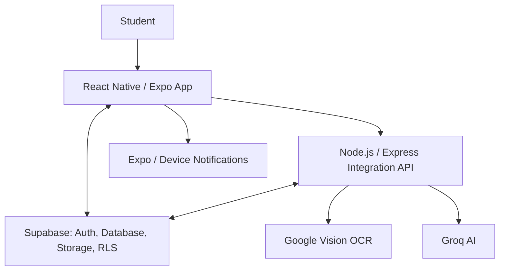
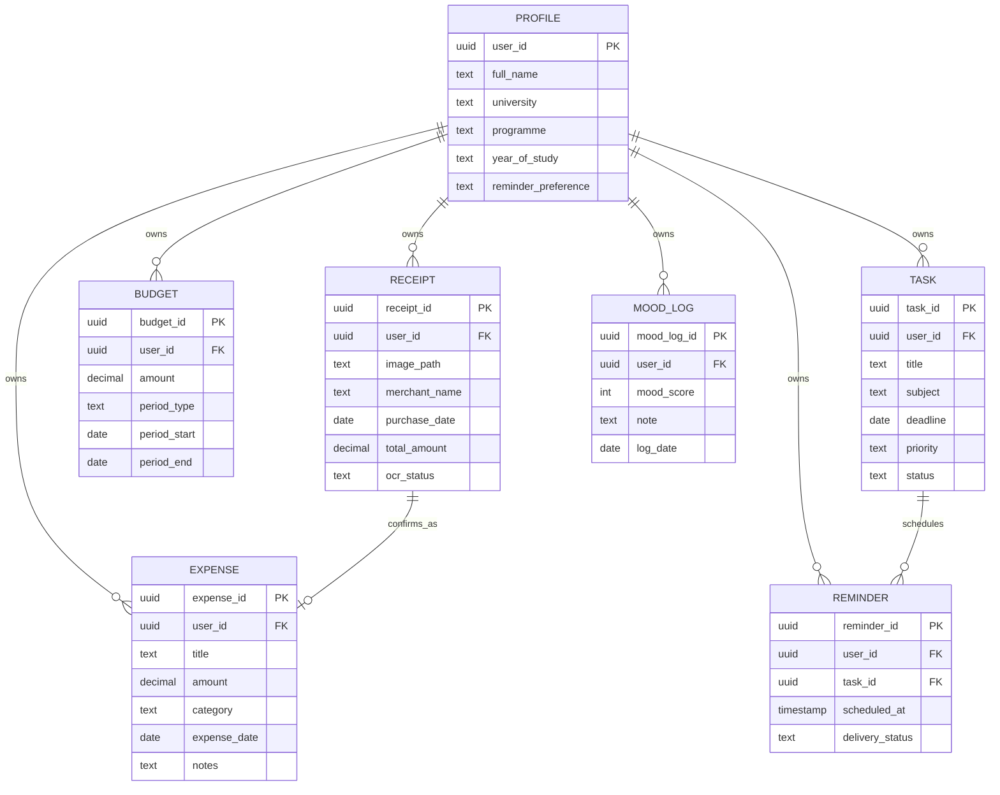
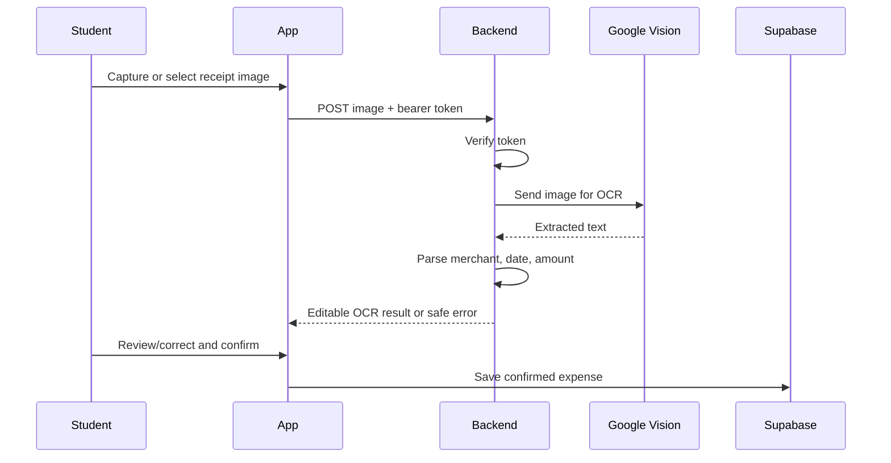
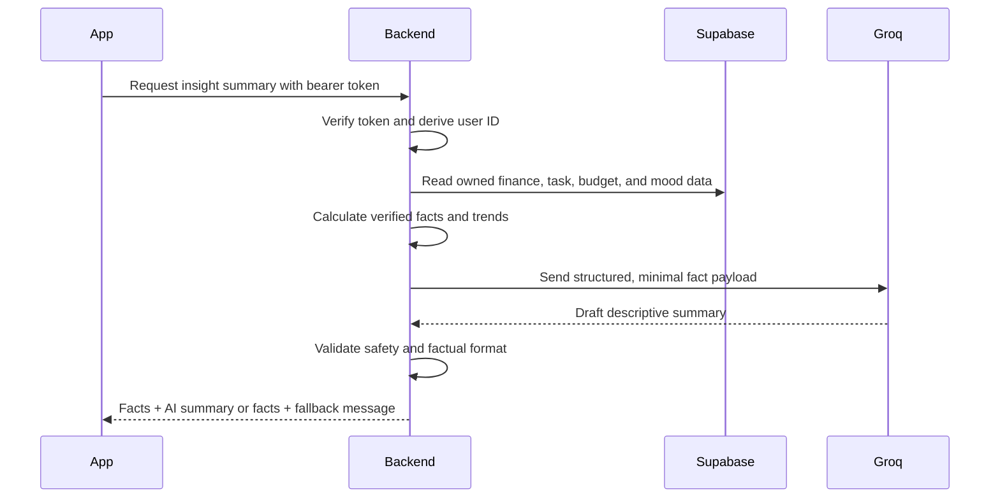

# Unifyd Software Design Document (SDD)

## 1. Purpose and design scope

This Software Design Document defines how the Unifyd PSM 2 requirements will be implemented. It is an implementation blueprint, not permission to add unapproved features. It supports the requirements in `UNIFYD_SRS.md` and must be read before coding a new phase.

## 2. Architectural goals

- Keep the mobile application fast and simple for student users.
- Protect each student’s data through Supabase Authentication and Row Level Security (RLS).
- Keep external API keys and provider-specific logic outside the mobile application.
- Use deterministic calculations for all important displayed facts.
- Use AI only for OCR extraction and optional descriptive summaries, with a safe fallback when unavailable.
- Preserve the existing Expo Router structure, including `/(tabs)`.

## 3. High-level architecture



### 3.1 Responsibility boundaries

| Component | Responsibilities | Must not do |
|---|---|---|
| React Native / Expo app | User interface, navigation, input validation, session-aware data display, local notification interaction | Store secret API keys or make trusted AI/OCR decisions alone |
| Supabase | Authentication, relational data storage, receipt-image storage if required, RLS enforcement | Expose one user’s records to another user |
| Node.js / Express | Verify caller token, call external providers, parse OCR result, calculate and validate insight payloads, apply fallback rules | Return provider secrets or accept unverified user IDs |
| Google Vision | Extract readable receipt text | Save a financial record without student review |
| Groq AI | Convert verified data into short descriptive insight text | Predict, diagnose, calculate authoritative totals, or override facts |
| Notification service | Schedule and deliver task reminders | Change task status when a notification is dismissed |

## 4. Mobile application design

### 4.1 Navigation model

The mobile application retains Expo Router navigation and uses the following functional areas:

| Area | Design responsibility |
|---|---|
| `app/_layout.tsx` | Initial application shell and authentication/session routing |
| Authentication screens | Welcome, sign-up, login, password-recovery/approved login support, and required profile completion |
| `app/(tabs)` | Protected primary navigation for Home/Dashboard, Wallet, Planner, Mind, and Profile |
| Wallet screens | Expense history, add/edit expense, budget view, receipt scanning and review |
| Planner screens | Task list, task detail, add/edit task, reminder history/settings access |
| Mind screens | Mood entry, mood history, wellness suggestion |
| Home/Dashboard screens | Cross-module summary panels and detailed-module navigation |
| Profile screens | Personal data, reminder preference, permissions guidance, and logout |

Existing screens and folders must be preserved. New routes or components may be added only where required by the approved phase; unrelated routes must not be moved, renamed, duplicated, or removed.

### 4.2 Frontend responsibilities

- Maintain an authenticated session and redirect unauthenticated users to authentication screens.
- Check whether required profile data exists before showing protected main functionality.
- Perform user-friendly client-side validation before database/API calls.
- Use a dedicated service layer for Supabase, backend API, notifications, and local utilities.
- Represent loading, empty, successful, and failure states explicitly.
- Refresh server data after mutations rather than relying on stale local calculations.

### 4.3 Component design rules

| Component type | Examples | Rule |
|---|---|---|
| Presentation components | Expense card, task card, budget card, mood selector, summary card | Receive data and callbacks through props; do not contain provider secrets or direct external AI calls |
| Form components | Expense form, task form, profile form, mood form | Validate required fields and display field-specific feedback |
| Screen components | Wallet screen, planner screen, dashboard | Coordinate data loading, mutation actions, navigation, and UI states |
| Service modules | Supabase client, API client, notification service | Centralise provider communication and return typed/normalised results |
| Utility modules | Currency/date formatting, calculation helpers, validation | Remain deterministic and easy to test |

## 5. Backend integration design

### 5.1 Backend responsibilities

The Node.js/Express backend is required only for actions that need protected provider credentials or trusted processing:

- OCR receipt processing through Google Vision;
- integrated-insight preparation and Groq summary generation;
- server-side token verification and access control for those endpoints;
- response validation, error handling, and safe fallbacks.

Standard user-owned CRUD data may use Supabase directly from the mobile app, protected by RLS.

### 5.2 API endpoints

| Endpoint | Method | Caller | Purpose | Success response |
|---|---|---|---|---|
| `/api/health` | GET | App/developer | Confirm backend availability | Service status |
| `/api/ocr/receipt` | POST | Authenticated app | Process a selected receipt image | Editable merchant, date, amount, raw extracted text/status |
| `/api/insights/generate` | POST | Authenticated app | Generate a validated descriptive summary from verified facts | Module summaries, provider/fallback status |

### 5.3 Backend request rules

- The app sends the current Supabase access token in the `Authorization: Bearer <token>` header.
- The backend verifies the token before processing an OCR or insight request.
- The backend derives the authenticated user ID from the verified token; it must not trust a user ID supplied in the request body.
- The backend returns only data that belongs to the authenticated user.
- Provider API keys are stored only in backend environment variables.
- Backend errors must be converted into short, safe, user-facing error codes/messages; raw provider errors and secrets must not be exposed.

## 6. Data design

### 6.1 Entity relationship overview



### 6.2 Core tables and constraints

| Table | Key fields | Constraints and rules |
|---|---|---|
| `profiles` | `user_id`, name, university, programme, year, reminder preference | `user_id` links one-to-one with Supabase Auth user; essential profile data is required before protected use |
| `expenses` | `expense_id`, `user_id`, title, amount, category, `expense_date` | Amount must be greater than zero; category must be an approved value |
| `receipts` | `receipt_id`, `user_id`, image reference, extracted fields, OCR status | OCR output is draft/review data until confirmed as an expense |
| `budgets` | `budget_id`, `user_id`, amount, period type/start/end | Amount must be greater than zero; period type is weekly or monthly |
| `tasks` | `task_id`, `user_id`, title, subject, deadline, priority, status | Status is Pending, Ongoing, or Completed; title/subject/deadline required |
| `reminders` | `reminder_id`, `user_id`, `task_id`, scheduled time, status | Deleted/cancelled when the task is deleted or completed |
| `mood_logs` | `mood_log_id`, `user_id`, mood score, note, `log_date` | Unique constraint on (`user_id`, `log_date`) enforces one mood entry per day |

### 6.3 Data ownership and RLS policies

All user-owned tables must include `user_id` and enable RLS. The general policy pattern is:

```sql
auth.uid() = user_id
```

Required policy behaviours:

- A student can select, insert, update, and delete only rows where `user_id` equals their own authenticated user ID.
- Insert policies must require the inserted `user_id` to equal `auth.uid()`.
- The backend uses a verified authenticated context or carefully scoped server access; it must still enforce ownership before reading user data.
- Receipt images, if stored in Supabase Storage, must use user-owned paths and matching storage access policies.

## 7. Module design

### 7.1 Account and profile

1. App checks the Supabase session at launch.
2. If no valid session exists, show authentication flow.
3. If a session exists but the profile is incomplete, redirect to Complete Profile.
4. When the profile is complete, show protected `/(tabs)` navigation.
5. Profile changes update the `profiles` table and refresh displayed data.

### 7.2 Expense and budget calculations

Financial totals are deterministic. For a selected budget period:

```text
total_spent = sum(expense.amount within selected period)
remaining_balance = budget.amount - total_spent
daily_average = total_spent / number_of_elapsed_or_selected_days
category_percentage = category_total / total_spent × 100
```

When `total_spent` is zero, the UI must avoid division by zero and show a sensible zero/empty state.

### 7.3 OCR receipt flow



Parsing must be defensive: missing or uncertain values remain empty for student completion. The application must never auto-save a financial expense solely from OCR output.

### 7.4 Academic task and reminder flow

1. Student saves a valid task with a deadline.
2. The app determines the preferred reminder timing from the profile.
3. The reminder service schedules and records the reminder.
4. Changing the deadline reschedules the active reminder.
5. Completing or deleting the task cancels the active reminder and updates reminder status/history.

### 7.5 Mood and wellness-rule flow

1. Student selects a mood and optional note.
2. The app checks whether the student already has a mood log for that date.
3. The app inserts the record or opens the existing record for editing.
4. The system retrieves recent mood records for the selected period.
5. A transparent backend/application rule checks whether a predefined low-mood threshold is met, for example a defined number of low mood scores within the last five to seven entries.
6. If met, the system displays a general self-care message and the non-clinical disclaimer.

The exact threshold must be defined once in a configuration/utility module and used consistently in tests and documentation.

### 7.6 Integrated insights flow



### 7.7 Groq prompt and response controls

The server prompt must constrain Groq to:

- describe only supplied facts;
- use supportive, concise, neutral language;
- avoid financial, academic, or clinical advice claims;
- avoid diagnosis, emergency instruction, prediction, and invented numbers;
- return a consistent structured response format.

Before display, the backend validates that required fields are present and rejects malformed responses. If validation or the provider request fails, it returns the calculated facts with a predefined fallback summary.

## 8. Error-handling design

| Situation | Application behaviour |
|---|---|
| Invalid form input | Keep entered values, highlight the field, and show a brief correction message |
| Supabase/database failure | Show a retry message; do not claim the data was saved |
| No data for a module | Show a helpful empty state and a path to the relevant recording action |
| OCR failure | Explain that the receipt could not be processed and provide manual expense entry |
| Groq failure/invalid response | Show verified facts plus fallback text; do not block dashboard use |
| Notification permission denied | Explain how to enable permissions; keep tasks accessible in the planner |
| Lost session/unauthorised request | Clear invalid state and return the student to authentication |

## 9. Security design

- Use environment variables for Supabase configuration, backend URLs, Google credentials, and Groq keys.
- Never put Google Vision or Groq secret keys in the Expo client.
- Require bearer-token verification for protected backend endpoints.
- Use RLS for every user-owned database table and associated storage paths.
- Validate all server request payloads, including receipt file type/size and insight request format.
- Log only operational errors; avoid storing receipt contents, tokens, personal notes, or secrets in public logs.
- Provide user-facing errors that do not reveal internal provider details.

## 10. Requirement-to-design traceability

| SRS group | Design location |
|---|---|
| SRS-FR-001 to 007 | Sections 4.1, 4.2, 6.2, and 7.1 |
| SRS-FR-101 to 108 | Sections 4.1, 6.1–6.3, and 7.2 |
| SRS-FR-201 to 207 | Sections 5.1–5.3 and 7.3 |
| SRS-FR-301 to 307 | Sections 6.1–6.3 and 7.2 |
| SRS-FR-401 to 408 | Sections 4.1, 6.1–6.3, and 7.4 |
| SRS-FR-501 to 507 | Sections 4.1, 5.1, and 7.4 |
| SRS-FR-601 to 610 | Sections 4.1, 6.1–6.3, and 7.5 |
| SRS-FR-701 to 710 | Sections 5.1–5.3 and 7.6–7.7 |
| SRS-NFR-001 to 010 | Sections 2, 4.2–4.3, 6.3, 8, and 9 |

## 11. Implementation guardrails

Before a vibe-coding implementation task begins, the coding agent must:

1. read `UNIFYD_PROJECT_BRIEF.md`, `UNIFYD_PRD.md`, `UNIFYD_SRS.md`, this SDD, and `PROJECT_PROGRESS.md`;
2. identify the current approved phase and its related SRS requirement IDs;
3. make the smallest complete change needed for those requirements;
4. preserve unrelated Expo routes, screens, folders, and components;
5. run the application and relevant tests; and
6. update `PROJECT_PROGRESS.md` with changed files, implemented requirement IDs, test evidence, issues, and next actions.
